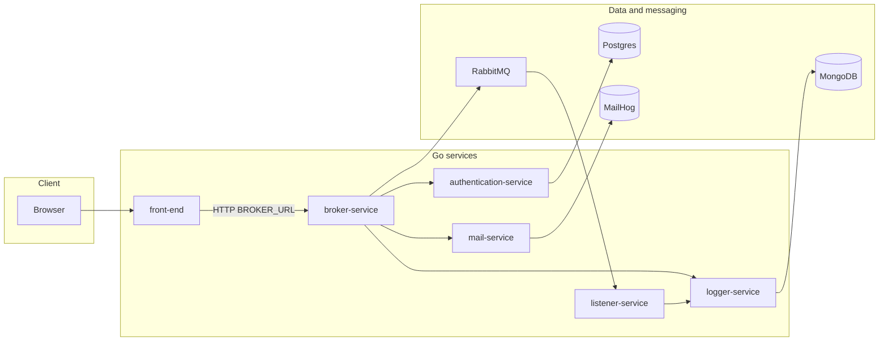

# Go microservices

[](https://go.dev/)
[](https://docs.docker.com/compose/)
[](https://kubernetes.io/)

Polyglot microservices written in **Go**: an HTTP **broker** (API façade), **RabbitMQ** for async work, **Postgres** and **MongoDB**, inter-service **HTTP**, **net/rpc**, and **gRPC**, plus **Docker Compose** and **Kubernetes** manifests. This repository is a focused demonstration of backend and platform patterns—not a production product, but a concrete codebase you can run and extend.

---

## What this demonstrates

| Area | What to look at |
|------|-----------------|
| **Broker / API façade** | [`broker-service`](broker-service): [Chi](https://github.com/go-chi/chi) router, CORS, `/ping`, JSON handlers in [`cmd/api/routes.go`](broker-service/cmd/api/routes.go) and [`cmd/api/handlers.go`](broker-service/cmd/api/handlers.go). Routes traffic to auth, mail, and logging over **HTTP**, **net/rpc**, **gRPC** (protobuf), and **RabbitMQ** queues. |
| **Authentication + SQL** | [`authentication-service`](authentication-service): Postgres via `DSN` env, connection retry, password checks, JSON API. |
| **Logging + document store** | [`logger-service`](logger-service): HTTP plus **RPC** (`:5001`) and **gRPC** (`:50001`), persistence with **MongoDB**. |
| **Event-driven consumers** | [`listener-service`](listener-service): Subscribes to RabbitMQ (`logs_topic`), unmarshals payloads, forwards to the logger over HTTP—see [`event/consumer.go`](listener-service/event/consumer.go). |
| **Transactional email** | [`mail-service`](mail-service): Sends mail with templates; Compose attaches **MailHog** for local capture. |
| **Server-rendered UI** | [`front-end`](front-end): Go `embed` for templates, `BROKER_URL` to call the broker from the browser. |
| **Packaging & orchestration** | [`project/docker-compose.yml`](project/docker-compose.yml), [`project/Makefile`](project/Makefile), [`project/k8s/`](project/k8s/), [`project/ingress.yml`](project/ingress.yml). |

---

## Architecture



The broker talks to the logger using **HTTP** (where implemented), **RPC**, or **gRPC** depending on the code path; the diagram shows the logical relationship. Async log-related traffic can flow **broker → RabbitMQ → listener → logger (HTTP)**.

---

## Repository layout

```
go_microservices/
├── authentication-service/   # Auth API, Postgres
├── broker-service/           # API gateway, RabbitMQ client, RPC/gRPC to logger
├── front-end/                # Embedded templates, calls broker
├── listener-service/         # RabbitMQ consumer → logger
├── logger-service/           # HTTP + RPC + gRPC, MongoDB
├── mail-service/             # SMTP-style mail to MailHog in dev
└── project/
    ├── docker-compose.yml    # Local stack
    ├── Makefile              # build / up / down / front-end
    ├── ingress.yml           # Ingress host rules
    └── k8s/                  # Per-service Kubernetes YAML
```

---

## Prerequisites

- **Docker** and **Docker Compose**
- **Go 1.17+** (module `go` directives use 1.17; newer toolchains work for builds)
- **GNU Make** (optional; you can run the same `docker compose` / `go build` commands by hand)
- A **Kubernetes** cluster and **Ingress** controller only if you deploy the `project/k8s` manifests

---

## Quick start

### 1. Start the backend stack

From the **`project/`** directory (the Makefile and Compose file live there):

```bash
cd project
make up          # start existing images
# or rebuild and start:
make up_build
```

**Host ports** (from [`project/docker-compose.yml`](project/docker-compose.yml)):

| Service | Host port | Notes |
|---------|-----------|--------|
| Broker | **8080** → container `80` | Public JSON API |
| Authentication | **8081** → container `80` | |
| Postgres | **25432** → `5432` | DB `users`, user `postgres` |
| MongoDB | **27017** | Root user in Compose |
| MailHog SMTP | **1025** | |
| MailHog UI | **8025** | View captured mail |
| RabbitMQ AMQP | **5672** | |

Stop the stack:

```bash
cd project
make down
```

### 2. Run the front-end (optional)

The front-end is **not** defined in `docker-compose.yml`; the Makefile builds it and runs it on the host.

Set **`BROKER_URL`** so templates can reach the broker (example):

```bash
export BROKER_URL=http://localhost:8080
cd project
make start      # builds ../front-end and runs it in the background
```

**Port conflict:** Compose maps **authentication-service** to host **8081**, while the front-end listens on **:8081** by default ([`front-end/cmd/web/main.go`](front-end/cmd/web/main.go)). You cannot use both defaults on the same machine. Pick one:

- Change the host mapping for `authentication-service` in `docker-compose.yml` (e.g. `18081:80`), **or**
- Run the front-end on another port (change `ListenAndServe` in the front-end and rebuild).

### 3. Try the broker

Examples (with the stack up):

- `POST http://localhost:8080/` — broker heartbeat JSON  
- `POST http://localhost:8080/handle` — JSON body with `action` (`auth`, `log`, `mail`) per [`HandleSubmission`](broker-service/cmd/api/handlers.go)  
- `POST http://localhost:8080/log-grpc` — gRPC-backed log path  

Use `curl` or the front-end page once `BROKER_URL` and ports are aligned.

---

## Kubernetes

Manifests live under [`project/k8s/`](project/k8s/). [`project/ingress.yml`](project/ingress.yml) defines example hosts **`front-end.info`** and **`broker-service.info`**; point those names at your ingress IP (e.g. `/etc/hosts` or DNS) or edit the rules for your cluster. Apply order typically follows dependencies (broker, databases, broker, workers); adjust namespaces and image names to match your registry.

---

## Contributing

Issues and pull requests are welcome. Please keep changes focused and consistent with existing patterns in each service module.

---

## License

**License: TBD.** Add a `LICENSE` file (for example MIT) when you want to clarify terms for reuse.
